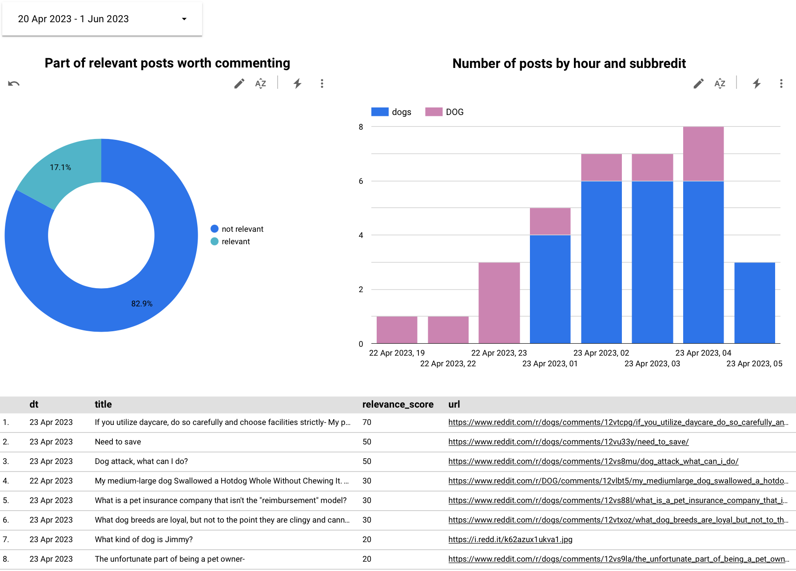

**Problem**

This tool is for small companies which want to tell people about their product.
It helps finding posts in reddit which are relevant to the product.
Then the founder can write some useful comment on the post and tell people about the product.

It also provides realtime analytics about the amount of reddit posts matching search phrase and part of relevant posts.

Insipired by [this tweet from @AdriaanvRossum](https://twitter.com/AdriaanvRossum/status/1633318894508146689)

**Tech stack**

Currently there is only one data source - reddit. It is possible to add more data sources in the future.
[Producer](producer.py) for Kafka is written in python. [Consumer](consumer.py) is written in pySpark


Target table is partitioned by `date` column. And clustered by `subreddit`.

[Charts can be seen here](https://lookerstudio.google.com/u/0/reporting/d6695ed0-35b6-4dc9-8f12-50eda7310086/page/WGaND)


**Instructions to run it**

- Clone this repo and download gcs connector jar
```
git pull
cd brand-monitoring-bi
wget https://repo1.maven.org/maven2/com/google/cloud/bigdataoss/gcs-connector/hadoop3-2.2.10/gcs-connector-hadoop3-2.2.10-shaded.jar
```

- Create [google project](https://console.cloud.google.com) and store credentials in `brand-monitoring-bi/google-services.json` file
- Create https://confluent.cloud enviroment
- Copy `terraform/variables.tf.example` to `terraform/variables.tf` and replace `<YOUR VALUE HERE>` with your values

- Create infrastructure using terraform
```
cd terraform
terraform init
terraform apply
```

- In main directory `/brand-monitoring-bi` ySetup python virtual environment activate it and install dependencies
```
python3 -m venv venv
source venv/bin/activate
pip install -r requirements.txt
```

- Start running producer and consumer
  - `python3 producer.py` 
  - `python3 consumer.py`

- Create visualization. An example can be seen here. 
  - lookerstudio.google.com does not support git versioning yet. So you need to do it manually.

**Additional**
Currenly chatgpt prompt for dog company is hardcoded. It can be changed in `transform.py line 26` file.
And search phrase for reddit is hardcoded in `producer.py line 75` file.
It can be changed.
